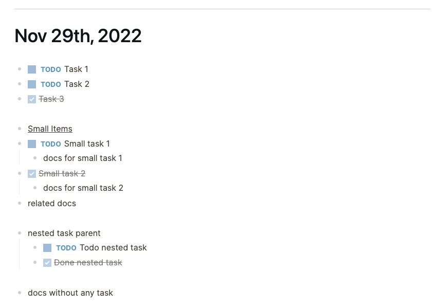

# logseq-plugin-daily-todo

This plugin has two functions:
* Every time a new journal is created - it moves all the unfinished tasks from the last journal to the new journal
* Adds handy shortcuts from OneNote to Logseq:
  * `cmd+1` - toggle TODO state of selected blocks between TODO/DONE/non-task block
  * `cmd+4` - highlight the selected block

The plugin skeleton and most shortcut handling is forked and updated from https://github.com/vipzhicheng/logseq-plugin-heading-level-shortcuts

Please note: this plugin is very specific to how I manage tasks in Logseq, and the code is still in an experimental but working state.
Suggestions and improvements are welcome.

## Usage

Every day when a new journal is created the plugin will:
* Move all the block groups (separated by an empty block) that still have unfinished TODO blocks from the last journal to the new journal.
* Any DONE block will be left in the last journal
* Title blocks (currently defined as having an underline style) will have a copy in both journals

For the following journal at end of day:

The plugin will change the two journals as following when a new journal is created:

## Installation

### Preparation

* Click the 3 dots in the righthand corner and go to `Settings`.
* Got to advanced and enable Developer mode.
* Restart the app.
* Click 3 dots and go to `Plugins`.

### Install plugins from Marketplace (recommended)

* Click `Marketplace` button and then click `Plugins`.
* Find the plugin and click `Install`.

### Install plugins manually

* Download released version assets from Github.
* Unzip it.
* Click `Load unpacked plugin`, and select destination directory to the unziped folder.

## Licence
MIT
